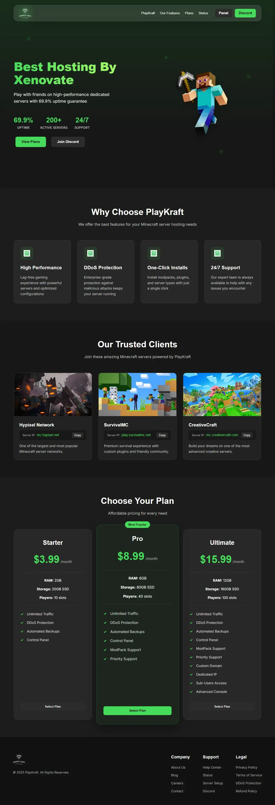

# PlayKraft Hosting

A modern Node.js web application for a Minecraft server hosting business built with Express and EJS templating.

## Features

- Responsive design with mobile-first approach
- Modern UI with glassmorphism effect
- Dynamic content using EJS templates
- Environment variables for easy configuration
- Centralized configuration system

## Installation


```bash
git clone https://github.com/Xenovate-Foss/Playkraft.git
```
```bash
npm run setup
```
That's It!

And Setup Node via config/config.js

## Project Structure

```
playkraft-hosting/
├── app.js              # Main application file
├── package.json        # Project dependencies
├── .env                # Environment variables
├── config/             # Configuration files
│   └── config.js       # Centralized configuration
├── public/             # Static assets
│   ├── css/            # Stylesheets
│   ├── js/             # JavaScript files
│   └── images/         # Images
│       ├── logo.png    # Original logo (black)
│       ├── whtite.png  # White logo for dark backgrounds
│       ├── black.png   # Black background image
│       ├── steve.png   # Minecraft Steve character
│       ├── features.png # Features icon
│       └── favicon.png # Site favicon
├── routes/             # Route handlers
└── views/              # EJS templates
```

## Configuration

The application uses a centralised configuration system in `config/config.js` that includes:

- Server settings (port, environment)
- Application information (name, description)
- External URLs (Discord, panel)
- Service metrics (uptime, server count)
- Feature data (server features, client showcases, pricing plans)


You can customise these settings by modifying the config file or updating environment variables.


# Preview



## Customization

- Replace icons
- Modify pricing plans in `config/config.js`

## License

This project is licensed under the MIT License - see the LICENSE file for details.

## Acknowledgements

- Font families: Poppins and Inter from Google Fonts
- Xerin & Vspcoderz 

